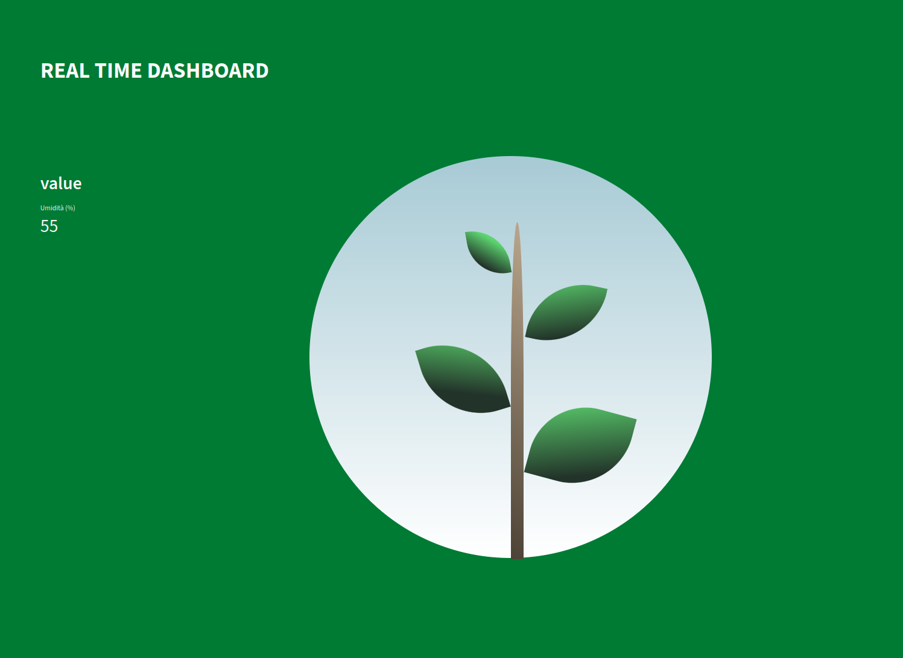

# IoP - Internet of Plants 🪴

### Progetto per Architettura e Progetto dei Calcolatori


## Panoramica

Il progetto consiste nel monitoraggio di varie metriche fondamentali alla salute di una o più **piante** (es. **Umidità del Suolo**) Tramite l'utilizzo di dispositivi **IOT** e Interfaccia Utente tramite **Web Dashboard**.

### Strumentazione

- **STM32F3 Discovery** Board principale
- **ESP32** Network
- **Sensori** per le misurazioni
- **STM32 CUBE IDE** Per la programmazione delle board
- **FastAPI** per la ricezione dei dati
- **Streamlit** per la visualizzazione della Dashboard

### Architettura


- Uno o più **sensori** effettuano misurazioni continue e inviano i segnali alla **board** che li riceve tramite **A/DC**.
- La board utilizza la **USART** per inviare i segnali elaborati all' **ESP32**.
- Quest'ultimo invia una **HTTP POST** all' **API REST** (api/dati per ricevere) dell'applicazione, che può in questo modo mostrare i dati sulla **Dashboard** (api/value per visualizzare l'ultimo valore ricevuto).
- **[OPTIONAL]** Utilizzo di un **Database** per giacenza e visualizzazione dei dati in ordine cronologico.
- **[OPTIONAL]** Utilizzo di un **Bot Telegram** per le notifiche di alert (es. livello critico di Umidità/Temperatura).
- **[OPTIONAL MA NON COSÌ OPTIONAL]** Deploy tramite **Docker** e scrittura di un **Docker Compose**.


## QUICKSTART

Creazione del **Python Virtual Environment** e installazione dei **Requirements**:

Aprire un terminale nella cartella della repo ed eseguire:

```bash
cd code
python -m venv .venv
source .venv/bin/activate
pip install -r requirements.txt
```

Utilizzo dello **Script di avvio**:

```bash
python run.py
```

Adesso vi saranno 2 **servizi** attivi:
- **Streamlit** sulla porta **8501**
- **API** sulla porta **8000**

Per visualizzare la **Dashboard** andare all'indirizzo:

http://localhost:8501



## DEPLOY DOCKER

nella cartella della repo:

```bash
docker build -t iop .
docker run -p 80:8501 -p 8000:8000 iop
```
Stavolta la web app sarà sulla porta 80

### HTTP POST di Prova

per testare se la configurazione è funzionante, aprire un nuovo terminale ed eseguire:

```bash
curl -X POST "http://localhost:8000/api/dati"      -H "Content-Type: application/json"      -d '{"umidita": 55}'
```

### Collegamenti Hardware

**ADC**: DO del sensore -> ADC_IN stm (PA0)
**USART**: USART_TX stm -> USART_RX esp32 e viceversa (PC4 -> G16; PC5 -> G17)
**Alimentazione**: Tutti i dispositivi condividono GND e 5V

### NETWORK

sostituire nel file **example.env.h** i valori:
**SSID**
**PASSWORD**
**API_ADDRESS:PORT/PATH/TO/API**

Se il server API non è associato ad un dominio, bisogna che sia connesso alla stessa rete dell'esp32.